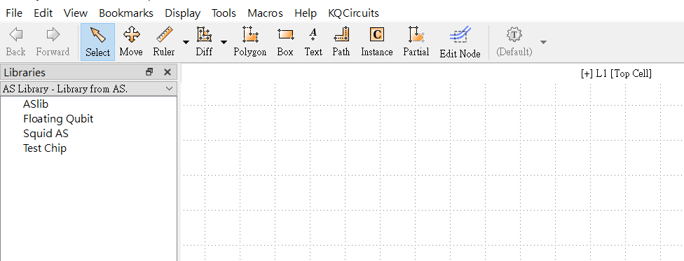

# Quick Start
## Setup KQCircuit
First, make sure [Klayout](https://www.klayout.de/) has been installed.

Then, follow the KQCircuit [Develop GUI setup guide](https://iqm-finland.github.io/KQCircuits/developer/setup.html) as follow (we assume the user is using Windows command prompt)
```
git clone https://github.com/iqm-finland/KQCircuits
```
Enter the your KQCircuits folder, then type
```
python setup_within_klayout.py
```
where your may need to replace `python` with your python executable.

Up to this step, you should be able to view the KQCircuit library in Klayout as shown in this [website](https://iqm-finland.github.io/KQCircuits/getting_started/first_look.html).

## Embed our customized components
Enter the folder `yourpath_to_KQC\KQCircuits\klayout_package\python\kqcircuits`, and clone our Github Repo
```
git clone https://github.com/shiau109/scq_layout
```
To make our customized library work properly, you need to modify the code in *KQCircuit*. First, open the file `yourpath_to_KQC\KQCircuits\klayout_package\python\kqcircuits\defaults.py`, and find the following lines
```
# Library names in dependency order. Every library should have its dependencies before its own entry.
kqc_library_names = (
    "Element Library",
    "Junction Library",
    "Test Structure Library",
    "Qubit Library",
    "Chip Library",
)
```
Modify it by adding `"AS Library"` into the list
```
# Library names in dependency order. Every library should have its dependencies before its own entry.
kqc_library_names = (
    "Element Library",
    "Junction Library",
    "Test Structure Library",
    "Qubit Library",
    "Chip Library",
    "AS Library"
)
```
Now, after restarting Klayout, you should be able to see the customized library in the panel


# Developer Guide
You can modify the code in `scq_layout` and view the result by the following two methods. In the following instruction, we assume you are in the `scq_layout` directory. 
## GUI
First, modify `viewer.py` to the object you want to inspect, and type
```
klayout -rm .\viewer.py -ne
```
where you may need to replace `klayout` with your klayout executable (e.g. `yourpath_to_klayout\Klayout\klayout_app.exe`). This will run the script `viewer.py` *within* klayout to show the pattern of your object. Note that `-ne` refer to non-edit mode, and your may use `-e` for edit mode.
## Standalone
Follow the KQCircuit [Develop Standalone module setup guide](https://iqm-finland.github.io/KQCircuits/developer/standalone.html), and you can use `viewer.ipynb` to view your object. The limitation of this method is that you cannot zoom in to view the layout in details, but it's more convenient for debugging because you can `print()` something out just as normal python code.